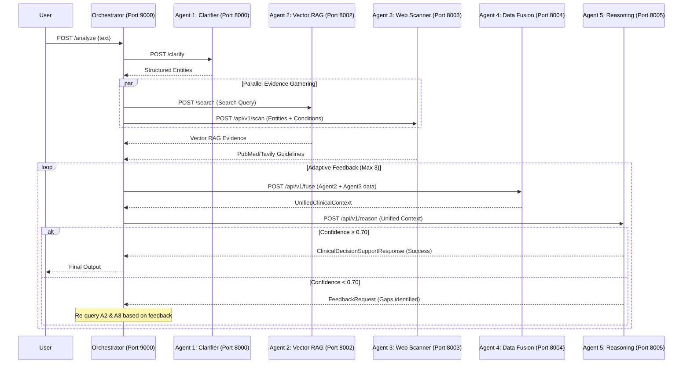

# CDSS — Architecture Document

## 1. System Architecture Flow

The system is designed as a loosely coupled microservices architecture. The central Orchestrator (CrewAI-based) manages the sequential flow and conditional loops across 5 specialized independent Agents.



## 2. Technical Stack

| Component | Technology |
|---|---|
| **API Framework** | FastAPI, Uvicorn |
| **Data Validation** | Pydantic |
| **Orchestration** | CrewAI, Python `asyncio` |
| **LLMs (Primary)** | Google Gemini (via `google-genai`), Llama 3.1 8B (via Groq) |
| **Vector Database** | Qdrant (Docker) |
| **Embeddings** | HuggingFace Sentence Transformers (`pritamdeka/BioBERT-...`) |
| **Data Ingestion** | BioPython (NCBI), Tavily API, HuggingFace Datasets |
| **Frontend (Agent 1)**| React, Vite, Tailwind CSS |

## 3. Directory Structure

```text
c:\Users\Karth\Documents\CDSS\
├── PRD.md
├── Architecture.md
├── Rules.md
├── Phases.md
├── Design.md
├── Memory.md
├── clinicalTextClassifier/   # Agent 1 (Entities & SNOMED CT)
├── vectorDbIngestion/        # RAG DB Builder (CLI)
├── vectorRetrieval/          # Agent 2 (BioBERT RAG Search)
├── evidenceScanner/          # Agent 3 (PubMed & Tavily Scanner)
├── dataFusion/               # Agent 4 (Merge, Detect Conflicts)
├── clinicalReasoning/        # Agent 5 (Decision & Feedback)
└── orchestrator/             # Master Controller (CrewAI)
```

## 4. Contract Schema Adapters
Because the agents were developed independently, the **Orchestrator** acts as the Anti-Corruption Layer, performing schema transformations:
* **Agent 1 Output** is mapped to Agent 2 `SearchRequest` and Agent 3 `EvidenceRequest`.
* **Agent 2 & 3 Outputs** are directly passed into Agent 4's `FusionRequest`, as Agent 4 inherently implements adapters for upstream payload variants.
* **Agent 4 Output** exactly matches Agent 5 Input (`UnifiedClinicalContext`).
* **Knowledge Graph** is intentionally stubbed out (`kg_evidence = []`) during transformation.
